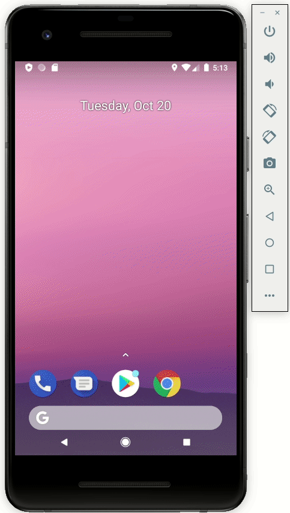
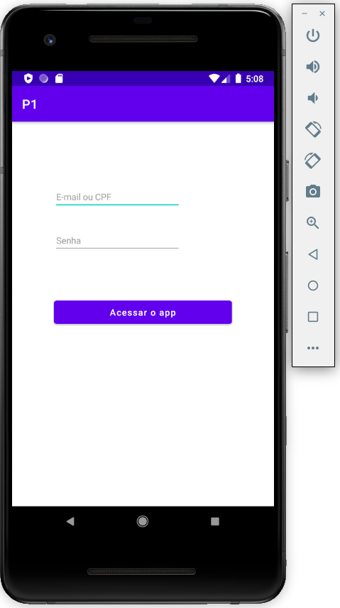
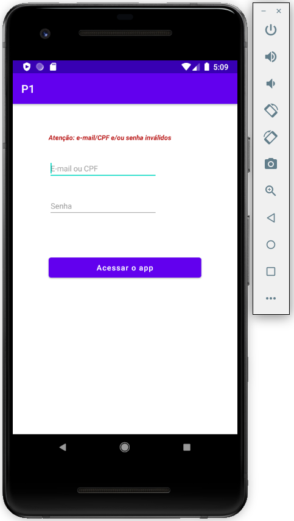
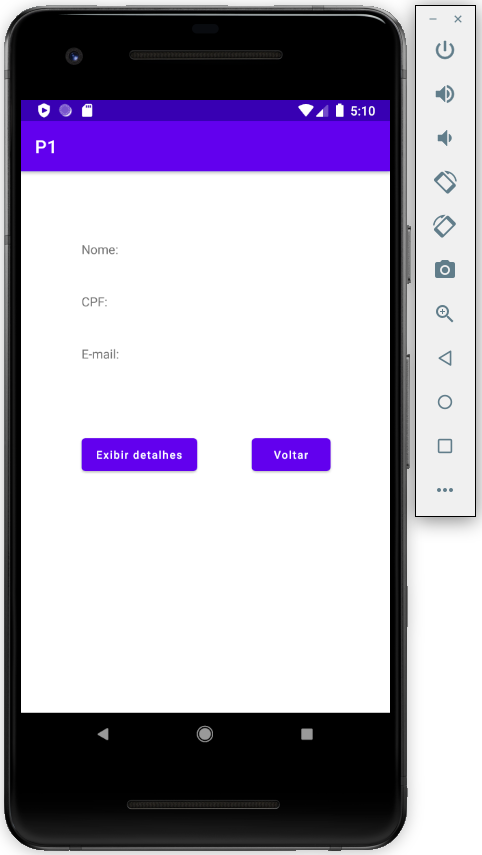
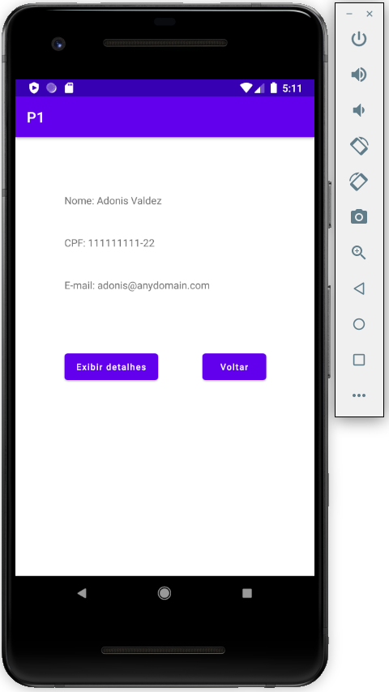

### Faculdade: UNICEP - Centro Universitário Central Paulista (Rio Claro - SP)

### Curso: Bacharelado em Sistemas da Informação

### Matéria: Desenvolvimento de Sistemas para Web e dispositivos Móveis (6º Período)

Aluno: Gismar Barbosa - Prova 1 - Link para respositório: *<https://github.com/gismarb/DSWDM_I_P1>*

------

#### Tarefa: 

Criar uma App conforme [Exemplo](https://framer.com/share/Prova-P1--oGXlUWVWMgiH7KID71RW) .

***Atenção:*** *este repositório tens fins didáticos (representa uma tarefa e/ou avaliação solicitada em um curso de gradução). Desta forma, as funcionalidades, assim como soluções foram desenvolvidas dentro das premissas e condições (desenvolvimento do tema até o presente momento - 20/10/2020) solicitadas.*

#### Inténs a serem Avaliados:

- [x] C1 - Criação da tela de login usando ConstraintLayout 2,5 pontos;
- [x] C2 - Criação da tela de exibição usando ConstraintLayout 2,5 pontos;
- [x] C3 - Ação para o botão acessar o app 2,0;
- [x] C4 - Ação para o botão voltar o app 2,0;
- [x] C5 - Ação para o botão exibir detalhes 1,0;
- [x] EXTRA - C6 - Função extra de Login/Senha inválido, usuário Fake em uma lista e outras regras 2,0.

#### Imagens do App:

#### Referências Extras:

[Android Developers: Start another activity](https://developer.android.com/training/basics/firstapp/starting-activity)

[Android Developers: Build a Responsive UI with ConstraintLayout](https://developer.android.com/training/constraint-layout)

[Android Developers: TextView](https://developer.android.com/reference/android/widget/TextView)

[EnvatoTuts+: Kotlin a partir do Principio - Classe e Objetos](https://code.tutsplus.com/pt/tutorials/kotlin-from-scratch-classes-and-objects--cms-29590)

[Medium (Manoel Afonso): Trabalhando com listas em Kotlin - Fold e Reduce](https://medium.com/@mano.afonso93/trabalhando-com-listas-em-kotlin-fold-e-reduce-58e582b47729)

[Medium (Mohak Puri): Kotlin Coroutines - Thread.sleep() vs delay](https://medium.com/@mohak1712/kotlin-coroutines-thread-sleep-vs-delay-63171fe8a24)

